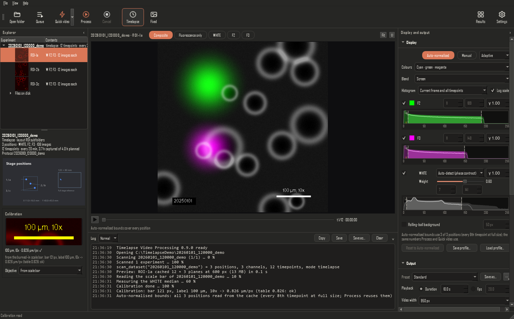
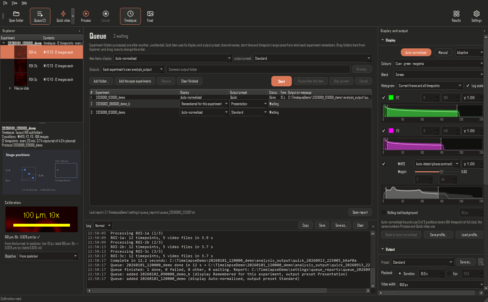

# Timelapse Video Processing

A Windows desktop app that turns Etaluma LS720 microscope captures into timelapse videos, channel composites, montages and simple measurements. Open a capture folder, look at the data, set how each fluorescence channel should look, and press one button.

For Etaluma LS720 captures. Developed by **BIOMIS Team, SATIE laboratory, ENS Paris-Saclay**. Version 1.0. MIT licence. For research use only; not for diagnostic or clinical use.

> This project is independent: it is not affiliated with, endorsed by or supported by Etaluma, Inc. Etaluma, Lumaview and LS720 are trademarks of Etaluma, Inc.



## Download for Windows

| What | Link |
|---|---|
| **Everything in one zip**: installer, uninstaller, install steps (README.txt), checksums, licences | [**Timelapse-Video-Processing-Windows.zip**](https://github.com/alantherajjeffrey/timelapse-video-processing/releases/latest/download/Timelapse-Video-Processing-Windows.zip) |
| The installer alone | [Timelapse-Video-Processing-Setup.exe](https://github.com/alantherajjeffrey/timelapse-video-processing/releases/latest/download/Timelapse-Video-Processing-Setup.exe) |

Unpack the zip (right-click, **Extract All**), then double-click `Timelapse-Video-Processing-Setup.exe`. Windows 10 or 11, 64-bit; no administrator rights, no Python. The links always give the latest version; every version is on the [Releases page](https://github.com/alantherajjeffrey/timelapse-video-processing/releases). GitHub's green **Code → Download ZIP** button gives the source code instead, not the ready-to-install zip.

## What it does

- **Reads Lumaview capture folders as they come off the microscope**: stage positions (`ROI-1a`) or labware wells (`Wella1`, `Welli11`), a folder per position, a folder per channel, or every file in one folder; timelapse or single images; WHITE (transmitted light) and the F1, F2, F3 fluorescence channels.
- **Shows the experiment before anything is processed**: positions with thumbnails, the stage map, a live preview of every timepoint, and each channel's intensity histogram.
- **Makes overlapping fluorescence visible**: automatic or hand-set black and white points per channel, gamma, colours, a blend that keeps overlaps visible, a dimmed WHITE underlay, and optional rolling-ball background subtraction. The same numbers apply to every position and timepoint, so brightness stays comparable.
- **Writes the videos in one click**: per position, a composite with WHITE, a fluorescence-only composite and, if wanted, one video per channel, as MP4 and AVI. Elapsed time (`Day 1 : 02:00:00`), the experiment and position name, a readable scale bar and a colour key of named channels can be drawn on them.
- **Runs a queue of experiments unattended**: add folders (a folder of experiments adds each one inside), give each item a display and an output preset, press Start. A failed item is reported and the next one starts.
- **Keeps output choices as presets**: Quick, Standard and Presentation built in, plus your own, for Quick video, Process and the queue.
- **Adds montages and measurements**: timepoint montages rendered like the videos; for single images, composites, panels, positive-pixel masks and a quantification table.
- **Reads the objective from the image**: the scale bar Lumaview burns into every image gives the pixel size.

## Install and uninstall

Run `Timelapse-Video-Processing-Setup.exe`, from the zip or on its own (see [Download for Windows](#download-for-windows)). The same installer is also at the top of the repository (`Timelapse-Video-Processing-Setup.exe`), with the uninstaller and `SHA256SUMS.txt`; the Releases page keeps every version. It installs for the current Windows user: no administrator rights, no Python, no internet. Windows 10 or 11, 64-bit. The installer is not code-signed, so Windows SmartScreen may say "Windows protected your PC": click **More info**, then **Run anyway**.

`Uninstall-Timelapse-Video-Processing.exe` (also on the Releases page, and in Windows Settings → Apps) removes the app and, unless you tick "keep my settings", its settings and caches. Nothing ever touches the `analysis_output` folders in your data.

To see whether a newer version exists, choose **Help → Check for updates**. The app asks GitHub only then, never by itself, and downloads nothing: a newer version comes with a link to its release page.

## Try it without a microscope

With the source code and Python installed (see [Developing](docs/DEVELOPING.md)):

```text
python tools/make_demo_dataset.py "C:\demo\20260101_120000_demo"
```

writes a small synthetic experiment (three positions, WHITE, F2 and F3, burned-in timestamp and scale bar). Open it with **Open folder**.

## Quick start

1. **Open folder.** Choose one experiment folder, or a parent folder that holds several. The explorer fills at once; the preview shows the first position within a second or two, and the whole timeline can be scrubbed while the rest loads. Every position is measured in the background for the automatic display.
2. **Quick video.** One click writes 1900 px MP4 videos with the Auto-normalised display, the elapsed time and the experiment and position name (the Quick preset). The arrow beside the button picks another display or output preset.
3. **Or tune, then Process.** Switch the display to Manual, drag each channel's black and white points on its histogram, name the channels, choose what goes on the videos, then press **Process**.

Reopening an experiment brings back its display settings, channel names, start time and timepoint range.

## Queue: several experiments, unattended

**Queue**, beside Open folder (or "Add folders to the queue" on the welcome page), opens a list of experiment folders processed one after another:

1. **Add folder…**, or drag folders from Explorer. A folder of experiments adds each experiment inside it; **Add the open experiments** adds what is open.
2. Each item has a **display** and an **output preset**: the defaults for new items are at the top, and each row can be changed until it starts. Channel names, start time and timepoint range come from what each experiment remembers.
3. **Start.** Items run in order; drag rows to reorder them. A failed item is marked and the next one starts; a full disk pauses the queue. **Pause after this item**, **Skip current** and **Cancel** are there throughout.
4. At the end the page and a text report list every item with its time and output folder. Double-click a row to open its output.

Outputs go into each experiment's own `analysis_output`, or into one common folder with a subfolder per experiment. While the queue runs you can keep opening and previewing folders; Quick video and Process then add to the queue. Closing the app asks whether to stop after the current item or at once; the queue is kept and the next start offers to resume it (a run folder left unfinished is renamed `…_incomplete`). The app never changes sleep, shutdown or any other Windows setting.



## Display choices and output presets

The **display** of a Quick video or a queue item is one of:

- **Auto-normalised**: black and white points measured on each experiment, with the default colours.
- **Remembered for this experiment**: the display last used for that experiment, else Auto-normalised.
- **A saved display profile**: a Manual profile applies its black and white points unchanged to every experiment.
- **Current display settings**: a copy of the Display panel, taken when the item is added or the button pressed.

An **output preset** decides which videos are written (each channel, composite with WHITE, fluorescence only), their width, AVI and/or MP4, quality and playback length, montages, dashboard, and what is drawn on the videos:

| Preset | What it writes |
|---|---|
| Quick | 1900 px MP4, every video, montages and dashboard, time and name on the videos |
| Standard | 950 px AVI and MP4, every video, montages and dashboard, time on the videos |
| Presentation | 1900 px MP4 at high quality, the composite only, time on the video |

Pick one at the top of the Output panel (it fills the panel; any change shows "Current (modified from …)"), save your own with **Save as…**, rename or delete them with **⋯**. Channel names, start time and timepoint range belong to each experiment and are not part of a preset.

## Folders it reads

| Layout | Example |
|---|---|
| A folder per position | `20260313_195541_CD14\ROI-1s1a\User_ROI-1s1a_F2_000012.tif` |
| Labware wells | `20260913_002031\Wella1\User_Wella1_F1_000003.tif` |
| A folder per channel inside each position | `20260913_002653\Welli11\F1\User_Welli11_F1_000000.tif` |
| Every file in the experiment folder | `20260913_003438\User_Wellc2_F3_000001.tif` |

File names follow Lumaview: `<user>_<position>[_<note>]_<channel>_<timepoint>.tif`, 8-bit TIFFs. The protocol file (`.epf`) gives the capture interval and stage positions; AviSynth files (`.avs`) and thumbnails are used when present. Output folders of earlier runs are never read as data.

## What you get

Every run writes a new folder, never overwriting one: `<experiment>\analysis_output\run_<date>_<id>\` (Process and every preset but Quick) or `quick_<date>_<id>\` (the Quick preset).

| Where | Content |
|---|---|
| top of the run folder | The videos, `<experiment>_<position>_<kind>.mp4` (and `.avi`); for single images, composites, panels and `<experiment>_quantification.csv`. |
| `montages\` | Composite, fluorescence-only composite and each channel at five timepoints; plate overviews for single images. |
| `masks\` | Single images: positive-pixel masks. |
| `info\` | The run's log, the exact display profile and calibration used, metadata, manifests with every source file, dashboard, and small video posters. |

## Display: making overlapping fluorescence visible

Each fluorescence channel is stretched between a black and a white point, optionally with gamma, coloured, and blended with the others. **Auto-normalised** picks the points from the full-size images of every position (every 8th timepoint): Adaptive (default; just above the background peak to the 99.9th percentile), Classic (0 to the brightest frame's 99.5th percentile) or Background cut (90th to 99.9th percentile). **Manual** starts from the Auto-normalised values; drag the handles on the histograms. Colours: cyan, green, magenta or blue, green, red, or any colour. Blends: screen (default), additive, maximum. The formulas and the reasoning are in [ALGORITHMS.md](docs/ALGORITHMS.md). Measurements always use the raw pixel values. Auto-normalised is a linear stretch between the two points (normalisation), not histogram equalisation. Rolling-ball background subtraction is off unless you switch it on.

## On the videos

- **Time**: start time + timepoint × the protocol's capture interval, as `Day d : hh:mm:ss` (days appear once the video reaches 24 hours, or always, or never). Type a start time when one experiment is split over several folders.
- **Experiment and position name** beside the time.
- **Scale bar**: a readable bar over Lumaview's own.
- **Channel key**: a colour square and the name of each channel (for example F2 = CFDA), set in the Output panel.

The Quick preset shows the time and the name.

## Calibration

Lumaview burns a scale bar with its label ("100 µm, 10x") into every image. The app measures the bar, reads the label and derives the pixel size, checks it against the LS720 objective table (4x 2.068, 10x 0.826, 20x 0.411, 40x 0.205 µm/px), and lets the bar win if they differ by more than 5 %. The objective can also be set by hand.

## Speed

On a 6-core PC with an SSD, a six-position, 196-timepoint, three-channel experiment takes about 134 s at 1900 px (MP4) and about 62 s at 950 px (AVI + MP4, second run). Most of the time is unpacking the compressed TIFFs and encoding H.264, both on every core. A hard disk is slower: reading 11 GB once takes over a minute there.

## Limits

- 8-bit, single-page TIFFs as the LS720 writes them; 16-bit or multi-page files are refused with a message.
- Labware-named positions (`Wella1`) have no stage coordinates in their protocol, so the stage map leaves them out.
- The preview is a 640 px copy; tiny bright specks look slightly dimmer there than in a 1900 px video.
- Not code-signed; updates only through Help → Check for updates. Planned and deferred work: [DESIGN_BACKLOG.md](docs/DESIGN_BACKLOG.md).

## For developers

The code is Python (PySide6, NumPy, OpenCV, tifffile, imageio-ffmpeg), in two parts: `source/etaluma_video/engine` (no interface code) and `source/etaluma_video/ui`. [DEVELOPING.md](docs/DEVELOPING.md) explains the structure, how to run it from source, the tests, how to add a feature, and how to build the installer and publish a release. [CHANGELOG.md](docs/CHANGELOG.md) lists every version.

Bug reports and suggestions: the project's Issues page. When the app shows its crash window, "Copy report" puts everything useful on the clipboard; it contains no image data.

## Licence

MIT licence (`LICENSE`). The installer also contains FFmpeg, a separate GPL-3.0 program that encodes the videos; its licence and where to get its source are in the third-party notices. Third-party components keep their own licences (`packaging/THIRD_PARTY_NOTICES.txt`, installed as `THIRD_PARTY_NOTICES.txt`).
